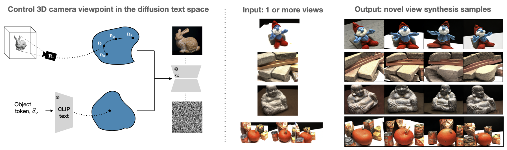

# Viewpoint Neural Textual Inversion (ViewNeTI)

This is the code for 'Viewpoint Textual Inversion: Unleashing Novel View Synthesis with Your Pretrained 2D Diffusion Model'. See the [project website](https://github.com/jmhb0/viewneti).




Abstract:
> Text-to-image diffusion models understand spatial relationship between objects, but do they represent the true 3D structure of the world from only 2D supervision? We demonstrate that yes, 3D knowledge is encoded in 2D image diffusion models like Stable Diffusion, and we show that this structure can be exploited for 3D vision tasks. Our method, Viewpoint Neural Textual Inversion (ViewNeTI), controls the 3D viewpoint of objects in generated images from frozen diffusion models. We train a small neural mapper to take camera viewpoint parameters and predict text encoder latents; the latents then condition the diffusion generation process to produce images with the desired camera viewpoint.
> 
> ViewNeTI naturally addresses Novel View Synthesis (NVS). By leveraging the frozen diffusion model as a prior, we can solve NVS with very few input views; we can even do single-view novel view synthesis. Our single-view NVS predictions have good semantic details and photorealism compared to prior methods. Our approach is well suited for modeling the uncertainty inherent in sparse 3D vision problems because it can efficiently generate diverse samples. Our view-control mechanism is general, and can even change the camera view in images generated by user-defined prompts.


# Setup
## Conda Environment
```
conda env create -f environment.yaml
conda activate view_neti
```

# Training 
## DTU dataset
Our code supports learning scenes from the [DTU dataset](https://roboimagedata.compute.dtu.dk/?page_id=36). Download it and put it in `data/dtu`. To use other datasets, see the section "Train on other datasets".

For computing metrics, we use masks from [RegNeRF](https://github.com/google-research/google-research/tree/master/regnerf), which can be dowloaded [here](https://drive.google.com/file/d/1Yt5T3LJ9DZDiHbtd9PDFNHqJAd7wt-_E/view?usp=sharing).

## The 'learnable modes'
Here's the ViewNeTI architecture:

 

The red components are learnable: the view-mapper $\mathcal{M}_v$ and the object-mapper, $\mathcal{M}_o$. Everything else is frozen. We train them differently depending on the `learnable_mode` parameter:

- 0: only learn $\mathcal{M}_o$. This is the original [Textual Inversion](https://textual-inversion.github.io/) setting and should be equivalent to running [NeTI](https://github.com/NeuralTextualInversion/NeTI). This is the one mode that works on datasets other than DTU. Every other mode is for novel view synthesis.
- 1: (no longer used)
- 2: learn $\mathcal{M}_v$ and $\mathcal{M}_o$ jointly on a single scene. 
- 3: learn $\mathcal{M}_v$ and $\mathcal{M}_o$ jointly over multiple scenes, where each scene has its own $\mathcal{M}_o$.
- 4: learn $\mathcal{M}_v$ and $\mathcal{M}_o$ jointly on a single scene, but starting with a $\mathcal{M}_v$ that was pretrained with mode 3.
- 5: the same as mode 4, but with $\mathcal{M}_v$ frozen.

## Training scripts
We use the [pyrallis](https://github.com/eladrich/pyrallis) for config, which uses config files that can be overwritten in the command. E.g. here is learnable mode 2:

```
python scripts/train.py --config_path input_configs/train.yaml --log.exp_name test_mode2 --learnable_mode 2  --optim.max_train_steps 3000 --data.train_data_dir data/dtu/Rectified/scan114 --data.dtu_subset 6
```

This will put results in `results/test_mode2`. The config variables for training are in `training/configs.py`. To manage GPU memory, use `optim.train_batch_size` and `optim.gradient_accumulation_steps`

## Example training scripts

### Mode 0: object-only learning (normal textual inversion)
```
python scripts/train.py --config_path input_configs/train.yaml --log.exp_name mode0_teapot  --learnable_mode 0 --data.train_data_dir data/datasets_mode0/colorful_teapot/
```

The `train_data_dir` should contain `.png` image files of the original object. We include one dataset in this repo, and you can find more in the [NeTI](https://github.com/NeuralTextualInversion/NeTI) codebase. 


### Mode 2: single-scene optimization.
```
python scripts/train.py --config_path input_configs/train.yaml --log.exp_name mode2_scan114 --learnable_mode 2  --optim.max_train_steps 3000 --data.train_data_dir data/dtu/Rectified/scan114 --data.dtu_subset 6
```

The `data.dtu_subset` can be {1,3,6,9} for the standard splits used in sparse-view novel view synthesis works, e.g. in [PixelNeRF](https://alexyu.net/pixelnerf/), [RegNeRF](https://m-niemeyer.github.io/regnerf/) and [FreeNeRF](https://jiawei-yang.github.io/FreeNeRF/) and [Nerdi](https://openaccess.thecvf.com/content/CVPR2023/papers/Deng_NeRDi_Single-View_NeRF_Synthesis_With_Language-Guided_Diffusion_As_General_Image_CVPR_2023_paper.pdf), or it can be {0} for all training images. When doing single-scene optimization, you can only expect novel-view 'interpolation' to work. This means that views far from the training set will not work well, and single-view synthesis (using `dtu_subset=1`) will not work well (more info in the paper results). 

 
### Mode 3: pretraining on multiple scenes
To pretrain a view-mapper ($\mathcal{M}_v$) on many scenes on the [DTU dataset](https://roboimagedata.compute.dtu.dk/?page_id=36), specify the parent directory of the DTU scenes, the list of scene subdirectories, and strings that are the tokens for those scene's object-mappers ($\mathcal{M}_o$) (e.g. "\<skull\>" is a placeholder token for the skull object). 
```
python scripts/train.py --config_path input_configs/train_m3.yaml --log.exp_name mode3_4scenes  --learnable_mode 3 --data.train_data_dir data/dtu/Rectified --data.dtu_subset 0 --optim.max_training_steps 100000 --data.train_data_subsets scan65,scan125,scan7,scan105 --data.super_category_object_tokens object,object,object,object --data.placeholder_object_tokens [<skull>,<statue>,<statue2>,<toy>
```

The view-mapper checkpoints will be saved like this: `results/mode3_4scenes/mapper-steps-50000_view.pt`.


### Mode 4/5: optimization with a pretrained $\mathcal{M}_v$ (and single-view novel view snythesis)
After pretraining a view-mapper (like in the last section), choose a checkpoint, and save a path to it in `training/pretrained_models.py`. This has a dictionary that maps integer keys to path names. E.g. if using model key 1, and doing novel view synthesis from only 1 view:

```
python scripts/train.py --config_path input_configs/train.yaml  --learnable_mode 5 --data.train_data_dir data/dtu/Recitified/scan114  --data.dtu_subset 1 --optim.max_training_steps 3000 --model.pretrained_view_mapper_key 1
```

Here is a sample pretrained view-mapper that has an architecture compatible with `input_config.yml`:
```
wget https://web.stanford.edu/~jmhb/files/viewneti/mapper-steps-50000_view.pt
```

### The validation loop 
Set validation frequency in `eval.validation_steps`. Since we didn't optimize this code, it's a bit slow: 10mins to run inference for 34 images in one scene for 3 seeds. If using `learnable_mode` 3, choose which scenes to do eval for in `eval.eval_placeholder_object_tokens` (remembering that too many eval scenes will be very slow). For validation to work, the model also has to be saved at the same step, which can be set with `log.save_steps`.

The validation does novel view synthesis on the standard 34 views used in DTU. For each random seed for diffusion sampling, it will make create an image that shows the ground truth images and the novel view predictions; the training views are marked with a yellow bar. The predicted images are also saved to a `pt` file.


### Logging
Logs to Tensorboard by default. For weights & biases, set config option `log.report_to='wandb'`

## Train on other datasets
<a id="other_datasets"></a>
To train on other datasets, you'll need to change some code to handle the different camera representations. The camera representation flag is set in the config under `model.camera_representation`. The files that need updating are `training/dataset.py`, wherever `camera_representation` is used, and file  `models/neti_mapper.py` wherever `deg_freedom` is used. 

## Checkpoints and predictions for DTU single-image and 3-image novel view synthesis
We provide checkpoints for single-image and 3-image NVS on DTU. These are the models you get from running  section "Mode 4/5" above. Download with:

```
gdown --fuzzy --output results/ https://
tar -xzvf results/view_neti_models.tar.gz
```

For example, `20230805_scan114_subs_1_m5_alpha5_augs7_pretrainkey8` is DTU scan 114, and `subs_1` means the training subset had only 1 input image. The pretrained mappers are saved for iterations 1500 and 3000. 

The saved checkpoints already have the outputs of running inference under the `inference` directory. For example `preds_iter_1500_seed0.png` is visualized predictions for iteration 1500, and diffusion sampling seed 0; a yellow bar above an image means it's a training image. Running `results=torch.load("results_all_iter_1500.pt"`)` gives access to image predictions, gt images, and masks. To run inference yourself, do:
```
python scripts/inference.py 
	--config_path input_configs/inference.yaml \
	--input_dir results/20230805_scan114_subs_1_m5_alpha5_augs7_pretrainkey8 \
	--iteration 1500
```
The DTU metrics can then be computed with `python scripts/summarize_dtu.py`

# Acknowledgments
Our code builds on [NeTI](https://github.com/NeuralTextualInversion/NeTI), the SOTA for textual inversion of objects and styles (at the time of writing).

In the NeTI codebase, they acknowledge the [diffusers implementation of textual inversion](https://github.com/huggingface/diffusers/tree/main/examples/textual_inversion) 
and the [unofficial implementation of XTI from cloneofsimo](https://github.com/cloneofsimo/promptplusplus).


